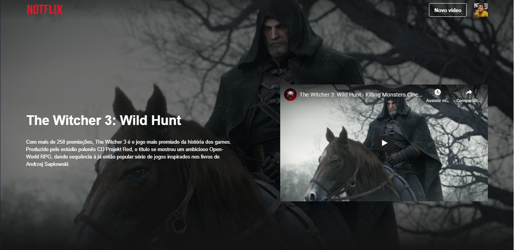

<p align="center">
  
</p>

## 



## 📖	Sobre o Projeto

Desenvolvido durante o evento Imersão React da Alura, o **Notflix** é um portal de cadastro de vídeos do Youtube. Nele é possível organizar os vídeos cadastrados em categorias, que podem ser criadas, configuradas e deletadas conforme desejar. 

Projeto desenvolvido em **React.Js**, com seu Banco de Dados armazenado em um arquivo **JSON**, configurado através do **NodeJs**.  


---
### Pré-requisitos

```
 - Node.js LTS 12.18
```

# ⚙️Instalando e Testando
Siga os passos abaixo respectivamente para uso do projeto em um terminal de sua preferência.

###1º- Clonando o repositório
  ```bash
  $ git clone https://github.com/leovdn/notflix
  ```

### 2º - Iniciando o Servidor/Banco de Dados

```bash
# Instale as depedencias
$ npm install

# Execute a API
$ npm start

Acesso: http://localhost:8080/

```

### 🖥️️ Executando a versão Web 	

```bash
# Execute a aplicação web
$ npm run dev

```


## Tecnologias Utilizadas

